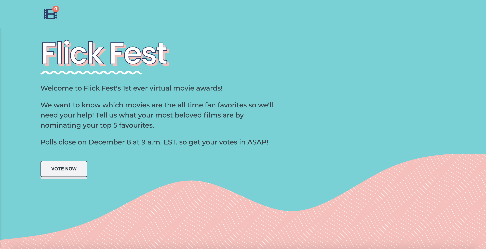

# The Shoppies 🎬

View the project <a href="https://shopify-movie.vercel.app/">here</a>.

 

An app to nominate your top 5 favourite films (data provided by <a href="http://www.omdbapi.com/">OMDB API</a>).

## Features ✨
- Tech and concepts used: 
    * Unit and Integration Tests with Jest and React Testing Library
    * React.js (bootstrapped with Create React App)
    * Modern ES6
    * CSS Modules

## Get Started 👩‍💻

Clone the repository and ensure the latest version of [Node.js](https://nodejs.org) is installed on your machine.

Go into the project directory and install all dependecies. 

```bash
cd NAME-OF-PROJECT
npm install
```

To start the development server...

```bash
npm start
```
## Run Tests 👩‍🔬

To run integration tests...

```bash
npm test src/__tests__/App.test.js
```

To run unit tests...

```bash
npm test src/components/Buttons/__test__/NominateBtn.test.js
```
```bash
npm test src/components/SearchMovie/__test__/SearchMovie.test.js
```

To run all tests at once...

```bash
npm test
```

## To Do 📝
(Improvements I would like to make if I had more time)

- Animation when adding new movies to nominations list
- Write additional integration tests for the following:
  * User can nominate a movie
  * User can't nominate more than 5 movies
  * User can remove a movie
